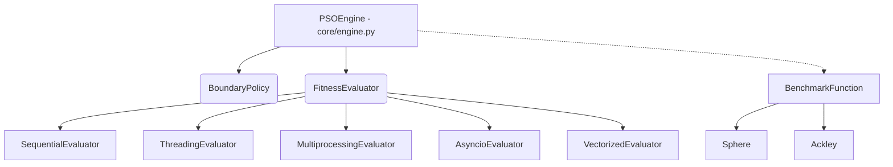

# Particle Swarm Optimization (PSO) - Parallel & Concurrent Benchmark

Este repositorio contiene una implementación completa, modular y mantenible del algoritmo **Particle Swarm Optimization (PSO)** en Python. El proyecto está diseñado como un banco de pruebas para evaluar el impacto de distintas estrategias de programación paralela y concurrente aplicadas a la optimización matemática de funciones continuas.

## Arquitectura del Proyecto

El sistema aplica el **Patrón Strategy** para aislar el motor matemático del PSO de las técnicas de paralelismo y las topologías, garantizando el Principio de Responsabilidad Única (SRP):

*   `pso/core/`: Motor central (`engine.py`) y topologías del enjambre (`topology.py`).
*   `pso/parallel/`: Estrategias de evaluación (Secuencial, Threading, Multiprocessing, Asyncio, Vectorizada).
*   `pso/objectives/`: Suite de funciones benchmark (Sphere, Rosenbrock, Rastrigin, Ackley).
*   `pso/io/`: Persistencia estructurada (JSON/NumpyEncoder) y gestión de directorios.
*   `pso/viz/`: Renderizado estático y dinámico (Matplotlib).
*   `experiments/`: Scripts ejecutables para la evaluación técnica del sistema.

## Instalación y Requisitos

Se requiere **Python 3.9+**. Se recomienda utilizar un entorno virtual (venv o conda) para evitar conflictos de dependencias.

```bash
# 1. Clonar el repositorio
git clone <url-del-repositorio>
cd pso-benchmark

# 2. Crear y activar el entorno virtual
python -m venv venv
source venv/bin/activate  # En Windows: venv\Scripts\activate

# 3. Instalar dependencias
pip install -r requirements.txt
```


---

## Guía de Ejecución y CLI

El proyecto centraliza las ejecuciones a través de scripts dedicados en la carpeta `experiments/`. Todas las ejecuciones generan salidas automáticamente en el directorio `results/`.

### Tabla de Comandos

| Acción | Comando de Ejecución | Output / Entregable |
| :--- | :--- | :--- |
| **1. Ejecución Simple** | `python experiments/run_pso.py` | Métricas en consola y plot estático de convergencia en `results/viz/`. |
| **2. Suite de Benchmarks** | `python experiments/run_benchmarks.py` | CSV de tiempos de ejecución (`results/benchmark_results.csv`). |
| **3. Grid Search** | `python experiments/run_grid_search.py` | Archivo JSON con metadatos del hardware, semillas y mejor configuración. |
| **4. Visualización 2D** | `python experiments/make_viz.py` | Animaciones del enjambre (formato `.gif`) en `results/viz/`. |

---

## Ejemplos de Uso y Reproducibilidad

### 1. Ejecutar una optimización individual
Valida el funcionamiento base del algoritmo minimizando la función Ackley (d=30) con paralelismo vectorizado.
```bash
$ python experiments/run_pso.py

=== Ejecución Simple de PSO ===
Función: Ackley
Dimensiones: 30
Límites: (-32.768, 32.768)

Optimizando...
=== Resultados ===
Iteraciones necesarias : 200
Tiempo total           : 0.0154 s
Mejor Fitness Final    : 2.34e-09
Ejecución terminada correctamente. Gráfico guardado en results/viz/...
```

### 2. Lanzar la batería de Benchmarks (Evaluación de Rendimiento)
Cruza todas las funciones objetivo y dimensiones (2, 10, 30) con las 5 estrategias de evaluación, midiendo los tiempos de *wall-clock* y el *overhead* de paralelismo.
```bash
$ python experiments/run_benchmarks.py
Realizando warm-up de los pools de procesos e hilos...
Evaluando: Sphere | Dimensiones: 30
  [1/60] Estrategia: V0_Sequential... Done.
  [2/60] Estrategia: V2_Multiprocessing... Done.
...
 Banco de pruebas finalizado. Resultados guardados en 'results/benchmark_results.csv'.
```

---

##  Estrategias de Paralelismo Implementadas

El sistema soporta el intercambio "en caliente" (hot-swap) de las siguientes estrategias de evaluación de fitness:

1.  **V0 - Secuencial (`SequentialEvaluator`)**: Baseline del proyecto. Bucle iterativo de Python puro.
2.  **V1 - Hilos (`ThreadingEvaluator`)**: Multihilo estándar. Útil para métricas de impacto del *Global Interpreter Lock (GIL)*.
3.  **V2 - Procesos (`MultiprocessingEvaluator`)**: Evasión del GIL mediante procesos del SO. Implementa *batching* (`chunksize`) para mitigar el cuello de botella de la comunicación inter-procesos (IPC) y la serialización (*pickling*).
4.  **V3 - Asyncio (`AsyncioEvaluator`)**: Concurrencia cooperativa. Aplicable para funciones objetivo asimétricas (ej. evaluación de fitness sujeta a latencia de red o I/O).
5.  **V4 - Vectorizada (`VectorizedEvaluator`)**: Paralelismo implícito basado en instrucciones SIMD del procesador vía backend C de NumPy. La variante de mayor rendimiento (CPU-bound) del proyecto.

## Diagrama de Arquitectura (Patrón Strategy)


## Documentación Adicional

En la raíz del proyecto (o carpeta `/docs`) encontrarás:
*   `design_document.pdf`: Justificación de la arquitectura de inyección de dependencias, decisiones de diseño y modelado de datos matricial.
*   `final_report.pdf`: Análisis crítico de resultados, gráficas de *speedup*, impacto del GIL e IPC, y conclusiones finales de la comparativa de paralelismo.